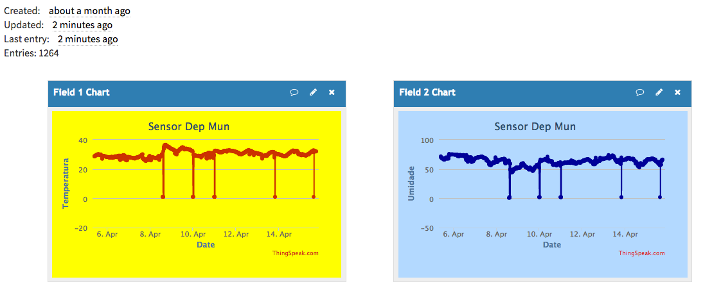

# IoT system for monitoring weather conditions in a storehouse of ammunition using prototype boards and C++

---

###### The Internet of Things has gained space and dynamism in the communication between interconnected electronic devices, contributing to favor value-added servi- ces for people and their surroundings, proposing reduction of human resources and costs, as well as the capture of several informational aspects, in an intelligent way for decision-making. Thus, the use of these technologies in constant development, the popularization of these objects in the most diverse sectors, both business, public and educational, make organizations more able to understand the environment that surrounds them. The present work aims to develop a system for monitoring the tem- perature and humidity in an storehouse for ammunition, using an embedded system, composed of an Arduino platform, integrated as DHT22 sensor and SIM900A module, in order to increase the knowledge about the Internet of the Things and raise subsidies for the activities of monitoring ambient temperature and relative humidity of the air in ammunition cartridges. The results show that it is possible to use emerging techno- logies of the Internet of Things in the management of these materials in relation to the automation of manual processes of data collection. Therefore, it is concluded that there is a vast field of research in the subject that can be optimized by researchers who wish to understand these physical quantities through intelligent devices.

---

### Tools

- Arduino UNO Board
- C++
- Arduino
- ThingSpeak platform

---

### Screenshots

### Live Demo

#### https://thingspeak.com/channels/258930
